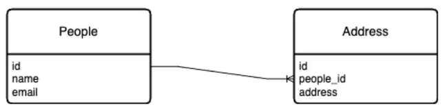

# JOIN

**JOIN** é uma **declaração SQL** que combina linhas de duas ou mais tabelas com base em uma condição de correspondência. Existem diferentes tipos de Joins, entre eles, **INNER JOIN, LEFT JOIN**, e RIGHT JOIN, cada um com sua própria função e resultado.

Observe a imagem a seguir:



Usando o **JOIN** para **combinar as duas tabelas**, podemos obter os seguintes resultados em uma consulta:

P.ID | P.NAME | P.EMAIL | A.ID | A.ADDRESS
--- | --- | --- | --- | ---
1 | Hudson Borer | borer-hudson@yahoo.com | 27 | 9611-9809 West Rosedale Road
1 | Hudson Borer | borer-hudson@yahoo.com | 47 | 101 4th Street
1 | Hudson Borer | borer-hudson@yahoo.com | 49 | 1243 West Whitney Street
1 | Hudson Borer | borer-hudson@yahoo.com | 56 | 495 Juniper Road


# ON
A **condição de correspondência** usada para combinar tabelas é a cláusula **ON** e ela é obrigatória para que a junção entre tabelas aconteça. A correspondência deve atender a condição informada, como no exemplo a seguir:

`select ... on tabela1.colunaA = tabela2.colunaA;`
```sql
SELECT ...
FROM tabela1
INNER JOIN tabela2
ON tabela1.coluna = tabela2.coluna;
```

A cláusula **ON** pode parecer com a **WHERE**, mas ambas são distintas. A cláusula WHERE é usada para filtrar registros e a ON é exclusivamente usada em junções de tabelas.

Observe a imagem a seguir:


A **condição de correspondência** para que as duas tabelas acima pudessem ser combinadas seria:
`select ... on People.id = Address.peopl_id;`

```SQL
SELECT ...
FROM People
INNER JOIN Address
ON People.id = Address.people_id;
```